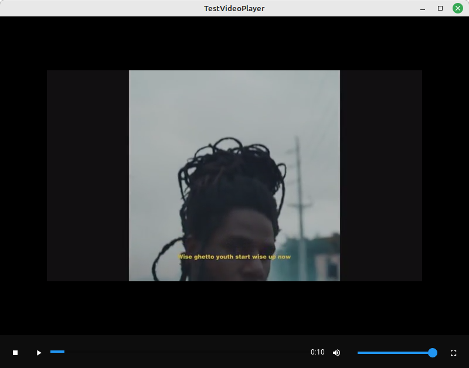

# Custom Video Player

This is a custom video player for Kivy using KivyMD components. The video player features play/pause, stop, volume, and fullscreen control buttons. It also shows the progress of the video, includes a thumbnail display, and caches the thumbnails for performance improvements.




## Installation

Clone the repository and navigate to the project directory:

```bash
git clone https://github.com/Noor-Kalibbala/CustomVideoPlayer.git
cd CustomVideoPlayer
```
## Dependencies

- Kivy >= 2.2.0 ([Installation](https://kivy.org/doc/stable/installation/installation.html))
- Python >= 3.9
- KivyMD >= 1.1.1


To install these dependencies, you can use the `requirements.txt` file included in this project:

Install the required packages:
```bash
pip install -r requirements.txt

```

## Running the Application

Start the video player with the following command:
```bash
python custom_video_player.py
```
This will start the custom video player with the included example video file (video_files/video_file.mp4) and thumbnail (video_files/thumbnail.png).

## Features

The video player includes the following features:

- Customizable control buttons.
- Responsive design.
- Full-screen mode.
- Volume control.
- Video progress bar.
- Keyboard controls.
- Auto-hide control buttons.
- Video thumbnail caching.
- Support for keyboard shortcuts.

## Directory Structure

- main.py : The main script to start the application.
- custom_video_player.py : The custom video player implementation.
- custom_video_player.kv : The Kivy layout file for the custom video player.
- video_files/ : Directory containing the video and thumbnail files.
- screenshot.png : A screenshot of the application.
- README.md : This readme file.

## Contributing

Pull requests are welcome. For major changes, please open an issue first to discuss what you would like to change.